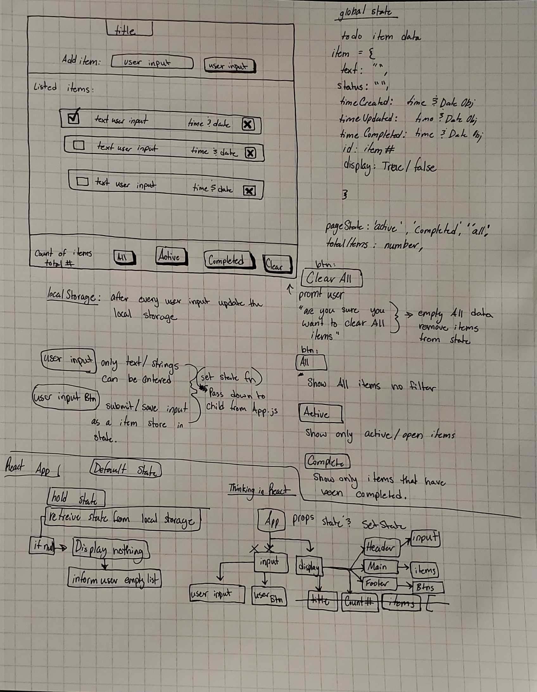
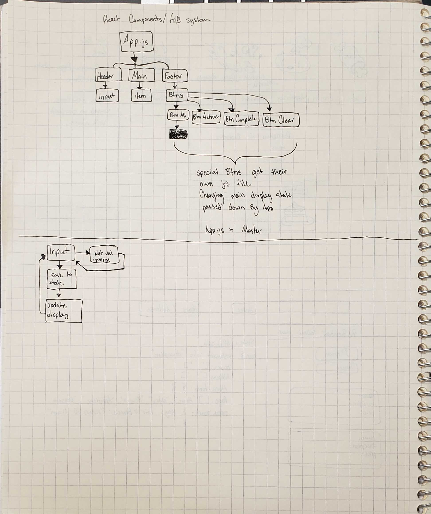

# TO-DO List React

## Tech Stack

1. HTML
1. CSS
1. Bootstrap
1. JS
1. React

---
## Requirements
To complete the assignment, you must complete the following:

1. Dynamically Render the content with React using components

1. Use Local Storage to store all to-do list data in the browser
1. Display all to-do list items
1. Three "views" for the user: All, Completed, & To-Do (not completed)
1. Display Prompting text to add item
1. Cross out or check off one item as "completed"
1. See a count of remaining items
1. Remove one item (either hard delete or soft delete/archive)
1. Check off or cross out all items in one click as a "completed all" function
1. Remove all completed items (soft delete/archive)
1. Ability to press a button and all checked off items become active again

#### A fully functional CRUD (Create, Read, Update, Delete) style application should be demoed at the end of the week.

---
### Wireframe
###### init planning layout and state

###### React Tree Master Components => Slave Components


---

## Pseudocode

### React File Hierarchy

Here is a quick plan to how I plan to layout my React files in my project. 

```
index.jsx
    V
App.jsx
    V
Header.jsx | Main.jsx | Footer.jsx => AllBtn.jsx,
    |           |                    ActiveBtn.jsx,
    |           |                    CompleteBtn.jsx,
    |           |                    ClearBtn.jsx
    V           V          
Input.jsx  | item.jsx | 

```

### State

State will be managed by App.jsx in this project since the program will not be too large or complex.
State and SetState will be passed down to the lower React components.
State will changed when the project is `Loaded` and when the `User Inputs` via a html text box or button.

### State Data & Structure

Note: A local storage element will need to be added to this project. I don't current know how to added local storage using this `Tech Stack`. A sandbox will be created to explore how to use local storage and incorporate it into the program.

Looking at the wireframe we have different elements/ atoms that may need to be recorded or change our state.

---

### Global State in App.jsx
`Note:` To keep things organized I will refer to the location/ `React Component` that will be affected by the State I am referring to. All State elements will be located in App.jsx file. 

I will label my elements state in key pair value format with generic value type names such as `String, Number, Array/List, Obj, Boolean, ect...`

#### App.jsx
```
pageState: Array[String,String,String]

```
**Ex:** `pageState: [active,completed,'all',deleted/archived]`

#### Header
```
Title: String
subText: String
userBox: String
```

### Main
```
subText: String
items: Array[
    item0:{
        id: String,
        text: String,
        status: String,
        display: Boolean,
        timeCreated: {date&time Obj},
        timeUpdated: {date&time Obj},
        timeCompleted: {date&time Obj},

    }    

    item1:{
        id: String,
        text: String,
        status: String,
        display: Boolean,
        timeCreated: {date&time Obj},
        timeUpdated: {date&time Obj},
        timeCompleted: {date&time Obj},

    }   

]
```

### Footer

```
totalItems: number
```

##### Note: Refer to WireFrame and React Component Hierarchy to see flow of state/ props

---
## Input / Setting A New State
Most of state will be managed by the inputs from the `User` here is a list of all input options that are available to the `User` organized in the Header,Main,Footer of our program.

#### Header
```
userInputBox
userSubmitBtn
```

#### Main
```
<item>
    CheckBtn
    DeleteBtn
</item>
```

#### Footer
```
AllBtn
ActiveBtn
CompleteBtn
ClearBtn
```

---


### Atoms of Organisms
Elements of organisms that will help layout the input / output of our app for the `User`
#### Header
```
Header: Text Title "To-Do List App"
subtext: 'Item Number #:'
userInputBox: 'Enter to-do here'
userInputBtn: 'Submit'
```
#### Main
```
subText: 'Your list of  to-dos'
item#: {checkbtn, text submitted by user, deleteBtn}
item#: {checkbtn, text submitted by user, deleteBtn}
item#: {checkbtn, text submitted by user, deleteBtn}
```

#### Footer
```
subText: 'total # of items'
AllBtn: 'All'
ActiveBtn: 'Active'
CompletedBtn: 'Completed'
ClearBtn: 'Clear All'
```

---

# Sandbox

1. How Do I use/ save local state

## Answer

    > Following MDN doc page on window.localStorage for JS shows us a clear way of creating,reading,updating, and deleting (CRUD) data in local storage. We can save our items objects in an array to local storage and follow (CRUD) using user input to modify the state.

`example JS code`
```
    function createNewItem(key, value) {
        localStorage.setItem(key,value)
    }
```
---

**Note:** 

Trying to follow the idea of thinking in React. We will write our base HTML/Bootstrap in our App file to help layout our application before we begin to break it up in React Components.

